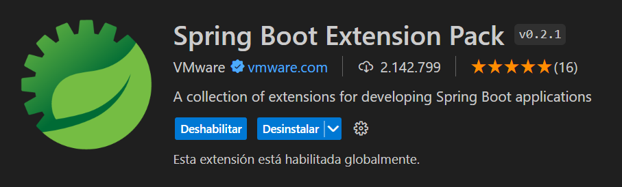

# Proyecto De Spring Gestor Academico

## Creación Del Proyecto

Antes de nada debemos instalar la extensión "Spring Boot Extension Pack".



Para crear el proyecto debemos pulsar la tecla F1 o la combinación de teclas Ctrl + Shift + P para abrir los comandos de Visual Studio Code. Introducimos "Spring" y seleccionamos la opción de crear un proyecto Maven mediante Spring Initializr. Seleccionamos las caracteristicas con las que queremos generar el proyecto, su versión, la versión de Java, lenguaje de programación (Java en nuestro caso), las dependencias...
Una vez terminemos el proceso nuestro proyecto será generado en la carpeta que le hemos indicado.

# Gestor Academica

Se nos pide diseñar un sistema simple de gestión para un centro educativo.
Se necesita almacenar información de:

* Profesores
    * Usuario
    * Password
    * Nombre
    * Apellidos
    * Email

* Alumnos
    * Usuario
    * Password
    * Nombre
    * Apellido
    * Telefono
    * Email

* Gestores
    * Usuario
    * Password

* Asignaturas
    * Nombre
    * Curso
    * Ciclo

    * Debemos tener en cuenta que una asignatura la pueden impartir varios profesores (Máximo 2) y se pueden matricular 32 alumnos


Se debe implementar un sistema de login y proteger la sesión con él. El usuario que hace login puede ser gestor, profesorado o alumnado (exclusivo). Los usuarios con perfil de gestor (como mínimo hay que implementar este rol) pueden ver alumnos, profesores y asignaturas, hacer el CRUD de dichas tablas, así como matricular a alumnos de asignaturas y asignar profesores a las mismas.

Hay que implementar tres maestros detalle: seleccionando un profesor, sus asignaturas, seleccionando un alumno sus asignaturas y seleccionando una asignatura el profesorado que la imparte y el alumnado matriculado.

Los alumnos pueden ver sus asignaturas así como el profesorado que las imparte. El profesorado puede ver las asignaturas que imparte así como la lista de alumnos matriculados.

Hay que hacer un menú en BootStrap 5.3.3 desplegable y que funcione y que, según el rol se muestran u ocultan partes. Hay que usar WebJars.

## Creación De Los Modelos o Entities

Primero que todo debemos crear los modelos o entities (Clases POJO).
Para crear estas clases nos apoyamos en distintas anotaciones:

### @Entity
    
    Marca una clase como entidad de base de datos, utilizaremos esta anotación en todas nuestras clases POJO.

### @Id y @GeneratedValue

    @Id y @GeneratedValue son anotaciones que van de la mano. @Id indica que campo es la clave primaria de la entidad. @GeneratedValue configura la generación automatica de la clave primaria.

### @Column

    Esta anotación permite especificar detalles sobre la columna de la base de datos al campo al que se le aplica esta anotación.

### @ManyToOne, @ManyToMany, @OneToMany y @OneToOne

    Estas anotaciones sirven para determinar la cardinalidad entre entidades. @ManyToOne establece una relación de muchos a uno. @ManyToMany establece una relación de muchos a muchos. @OneToMany establece una relación de uno a muchos. @OneToOne establece una relación de uno a uno.

Estas son mis clases POJO:

## PROFESOR

```Java
@Entity
public class Profesor {
    
    @Id
    @GeneratedValue(strategy = GenerationType.IDENTITY)
    private Long Id;

    @Column(length = 25)
    private String usuario;

    @Column(length = 100)
    private String password;

    @Column(length = 50)
    private String nombre;
    private String apellidos;

    @Column(length = 100)
    private String email;

    @OneToMany
    private List<Asignatura> asignaturas;
}
```

## Alumno

```Java
@Entity
public class Alumno {
    
    @Id
    @GeneratedValue(strategy = GenerationType.IDENTITY)
    private Long Id;

    @Column(length = 25)
    private String usuario;

    @Column(length = 100)
    private String password;

    @Column(length = 50)
    private String nombre;
    private String apellidos;

    @Column(length = 15)
    private String telefono;

    @Column(length = 100)
    private String email;

    @OneToMany
    private List<Asignatura> asignaturas;
}
```

## Gestor

```Java
@Entity
public class Gestor {
    
    @Id
    @GeneratedValue(strategy = GenerationType.IDENTITY)
    private Long Id;

    @Column(length = 25)
    private String usuario;

    @Column(length = 100)
    private String password;
}
```

## Asignatura

```Java
@Entity
public class Asignatura {
    
    @Id
    @GeneratedValue(strategy = GenerationType.IDENTITY)
    private Long Id;

    @Column(length = 30)
    private String nombre;

    @Column(length = 10)
    private String curso;

    @Column(length = 30)
    private String ciclo;

    @ManyToMany
    @JoinTable(name = "asignatura_alumno")
    private List<Alumno> alumnos;

    @ManyToOne
    @JoinColumn(name = "profesor_id")
    private Profesor profesor;
}
```

## Creación De Los Repositorios

Crearemos una interfaz por cada entidad la cual extiende de ```JpaRepository``` paratremizada con el tipo de entidad y el tipo de su clave primaria, en mi caso Long.